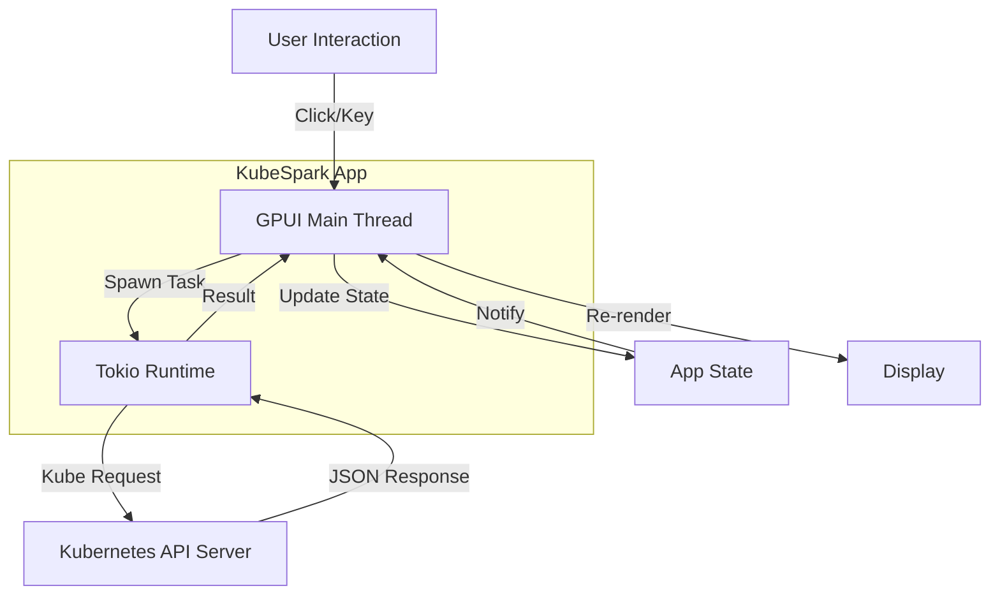

# Architecture

KubeSpark is designed as a hybrid asynchronous application, leveraging the **GPUI** framework for high-performance rendering (UI thread) and **Tokio** not just for Kubernetes operations, but as the backing runtime for all asynchronous tasks.

## Core Components

### 1. The Async Boundary
The most critical architectural pattern in KubeSpark is the separation between the **Main Thread (UI)** and the **Background Runtime (Tokio)**.

- **Main Thread (GPUI)**: 
  - Handles all input events (clicks, keypresses).
  - Performs layout and painting.
  - **Must never block**. Blocking here freezes the UI.
  - Manages application state (`KubeSparkApp` struct).

- **Tokio Runtime**:
  - Initialized in `main.rs` before the app starts.
  - Handles all I/O bound operations: Kubernetes API calls, file reading, network requests.
  - runs `kube-rs` futures.

### 2. State Management
KubeSpark follows a **unidirectional data flow** inspired by The Elm Architecture and React, adapted for Rust's ownership model.

1. **State**: The `KubeSparkApp` struct holds the "source of truth".
   - `resources`: Vector of current Kubernetes items.
   - `current_context`: String identifier for the connected cluster.
   - `connection_status`: Enum state (Disconnected, Connecting, Connected, Error).
   
2. **View**: The `render` method is a pure function (in principle) that takes the current State and produces a tree of UI Elements.

3. **Update**: Interactions trigger **Actions** (methods on `KubeSparkApp`).
   - If an action requires I/O (e.g., "Switch Context"), it spawns a task on the Tokio runtime.
   - The task executes asynchronously.
   - On completion, the task passes data back to the Main Thread via a callback or channel (`cx.update`).
   - The Main Thread updates the State and calls `cx.notify()`, triggering a re-render.

### 3. Kubernetes Integration Strategy
We use the `kube` crate (kube-rs) which is a mature, async-first Kubernetes client.

- **KubeClient Wrapper**: We wrap the raw `kube::Client` in our own `KubeSparkClient` (or `KubeClient` struct).
- **Discovery**: We use `Kubeconfig` to discover available contexts and clusters locally (`~/.kube/config`).
- **Dynamic Resource Handling**: 
  - We use strong typing (`k8s_openapi`) for known resources (Pods, Nodes).
  - We use `DynamicObject` for generic CRD support (planned).

### 4. Windowing System
KubeSpark uses a custom windowing implementation to ensure a consistent, theme-aware look across platforms (Linux, macOS).

- **Decorations**: System title bars are disabled.
- **Custom Controls**:
  - **macOS**: We reserve space for the native "traffic lights" but render our own background.
  - **Linux**: We render custom Minimize/Maximize/Close buttons using `gpui`'s window control APIs (`minimize_window`, `zoom_window`).
- **Glassmorphism**: Extensive use of transparency, blurs, and overlays (where supported by the compositor) to achieve a modern aesthetic.

## Data Flow Diagram

