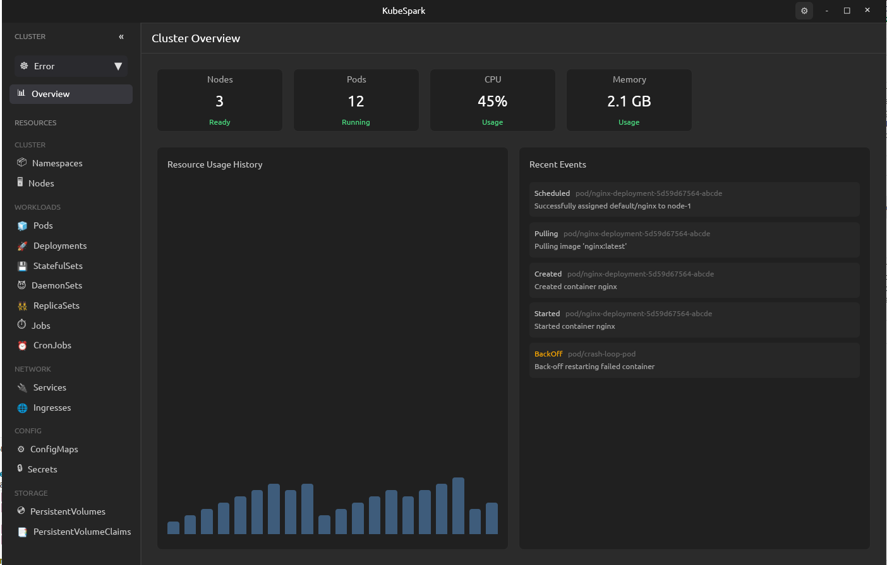
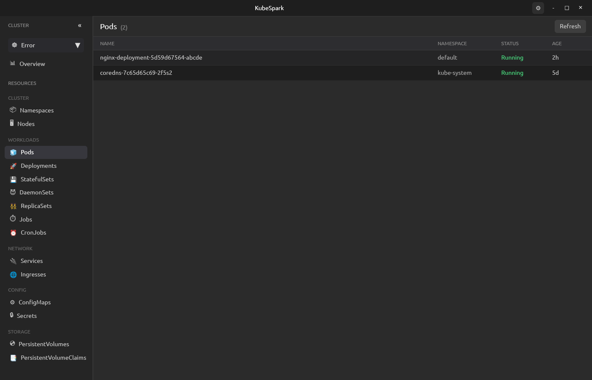

# KubeSpark - Kubernetes GUI Client

A modern, sleek Kubernetes GUI client built (a major chunk of it is vibe coded, but core is being built from scratch) with the Zed GPUI framework and Rust.

This is still in the implementation phase, and is not ready for production use. The journey has just started.

## Overview

KubeSpark is a Kubernetes cluster management application that provides a beautiful, performant interface for interacting with Kubernetes resources. Built using:

- **GPUI Framework**: The high-performance GPU-accelerated UI framework from Zed
- **gpui-component**: Community components for GPUI
- **kube-rs**: Native Rust Kubernetes client library
- **Tokio**: Async runtime for handling concurrent operations

## Screenshots

<div align="center">
  
  <p><em>Cluster Overview showing Nodes and System Status</em></p>
</div>
<br/>
<div align="center">
  
  <p><em>Workloads View - Pods List</em></p>
</div>

## Project Structure

```
kubespark/
├── src/
│   ├── main.rs                   # Application entry point
│   ├── app.rs                    # Main application state and logic
│   ├── kubernetes/               # Kubernetes integration layer
│   │   ├── mod.rs               # Resource types and enums
│   │   ├── client.rs            # Kubernetes API client
│   │   └── resources.rs         # Resource data structures
│   └── ui/                       # UI components
│       ├── mod.rs               # UI module exports
│       ├── titlebar.rs          # Custom titlebar with window controls
│       ├── sidebar.rs           # Resource navigation sidebar
│       ├── resource_list.rs     # Resource list view with table
│       ├── detail_view.rs       # Resource detail panel with YAML
│       └── status_bar.rs        # Connection status bar
├── Cargo.toml                    # Rust dependencies
└── README.md                     # This file
```

## Features

### Implemented

#### Kubernetes Client (src/kubernetes/)
- ✅ Connection to Kubernetes clusters via kubeconfig
- ✅ Support for multiple resource types:
  - Cluster: Namespaces, Nodes
  - Workloads: Pods, Deployments, StatefulSets, DaemonSets, ReplicaSets, Jobs, CronJobs
  - Network: Services, Ingresses
  - Config: ConfigMaps, Secrets
  - Storage: PersistentVolumes, PersistentVolumeClaims
- ✅ Resource listing with namespace filtering
- ✅ Pod logs retrieval with streaming support
- ✅ Age calculation and status formatting
- ✅ Full metadata preservation for YAML export

#### UI Components
- ✅ **Custom Titlebar**: Beautiful window controls with close and maximize buttons
  - macOS-inspired red close button and green maximize button
  - Custom app icon and branding
  - Clean, modern design without system titlebar
- ✅ **Main Application Layout**: Three-panel design (sidebar, content, optional detail panel)
- ✅ **Typography**: Professional font stack
  - Inter/Segoe UI/San Francisco for UI elements
  - JetBrains Mono/Fira Code for code/YAML display
  - Optimized line heights and spacing
- ✅ **Sidebar**: Categorized resource navigation
  - Resources grouped by type (Cluster, Workloads, Network, Config, Storage)
  - Hover and active states
  - Click handling for resource selection
- ✅ **Resource List View**: Table-based resource display
  - Column headers: Name, Namespace, Status, Age
  - Color-coded status indicators (Running/Active, Pending, Failed, Succeeded)
  - Hover states for row selection
  - Refresh functionality
- ✅ **Detail View**: Side panel for resource inspection
  - Basic information section
  - Full YAML representation of Kubernetes manifest
  - Scrollable content with syntax highlighting
  - Close button
- ✅ **Status Bar**: Connection status indicator
  - Real-time connection status (Disconnected, Connecting, Connected, Error)
  - Color-coded status indicators
  - Version information

#### Design System
- ✅ Dark theme with VS Code-inspired color palette
- ✅ Consistent spacing and typography
- ✅ Hover and active states throughout
- ✅ Flexbox-based responsive layout
- ✅ Accessible color contrasts

### Planned Enhancements

1. **Real-time Monitoring**
   - Auto-refresh resources at configurable intervals
   - Watch API for live updates
   - Resource metrics and health indicators

2. **Pod Logs Viewer**
   - Dedicated logs panel with streaming
   - Container selection for multi-container pods
   - Log filtering and search
   - Follow mode and auto-scroll

3. **Advanced Features**
   - Resource editing (kubectl apply)
   - Resource deletion with confirmation
   - Port forwarding
   - Shell access to pods (exec)
   - Context and namespace switching
   - Multi-cluster support

4. **Enhanced UI**
   - Search and filter across all resources
   - Sorting by columns
   - Resource graph visualization
   - Custom themes
   - Keyboard shortcuts

## Current Status

The application has a complete architectural foundation with:
- Fully implemented Kubernetes client layer
- Comprehensive UI component structure
- Modern, professional design system
- Modular, maintainable codebase

**Note**: The project currently has compilation issues due to GPUI API compatibility. GPUI is actively developed and its API may have changed. The code structure and logic are sound and follow GPUI patterns based on available documentation.

## Getting Started

### Prerequisites

- Rust 1.70+ (2021 edition)
- kubectl configured with access to a Kubernetes cluster
- Linux and macOS
- Windows (even with WSL/WSL2) is not supported, and will not be supported in the future

### Building

```bash
# Install dependencies (this will take a while for first build)
cargo build

# Run the application
cargo run

# Build optimized release version
cargo build --release
```

### Configuration

KubeSpark uses your default kubeconfig file (`~/.kube/config`) to connect to clusters. Ensure you have:

1. A valid kubeconfig file
2. Network access to your Kubernetes API server
3. Proper RBAC permissions for listing resources

## Development

### Key Design Patterns

1. **Separation of Concerns**: Kubernetes logic is isolated from UI code
2. **Immutable UI**: Following GPUI's declarative rendering model
3. **Async Operations**: All Kubernetes API calls are non-blocking
4. **Type Safety**: Leveraging Rust's type system for reliability

### Adding New Resource Types

To add support for a new Kubernetes resource:

1. Add the resource variant to `ResourceKind` enum in `src/kubernetes/mod.rs`
2. Implement the listing logic in `src/kubernetes/client.rs`
3. Update the `category()` method to assign the resource to a category

### Customizing the UI

UI components are in `src/ui/`. Each component is self-contained and uses GPUI's declarative API:

```rust
div()
    .flex()
    .flex_col()
    .bg(rgb(0x1e1e1e))
    .child(/* content */)
```

## Architecture

### Data Flow

1. **User Interaction** → UI Component
2. **UI Component** → App State Update
3. **App State** → Kubernetes Client (async)
4. **Kubernetes API** → Response
5. **Response** → App State Update
6. **State Change** → UI Re-render

### State Management

The `KubeSparkApp` struct holds all application state:
- Selected resource type and namespace
- Current resource list
- Selected resource for detail view
- Connection status
- UI layout preferences

### Async Pattern

All Kubernetes operations use Tokio's async runtime:
```rust
cx.spawn(|this, mut cx| async move {
    match client.list_resources(kind, namespace).await {
        Ok(resources) => {
            this.update(&mut cx, |app, cx| {
                app.resources = resources;
                cx.notify();
            }).ok();
        }
        Err(e) => log::error!("Error: {}", e),
    }
}).detach();
```

## Troubleshooting

### GPUI Compilation Issues

If you encounter GPUI-related compilation errors:

1. Check the GPUI version in `Cargo.toml`
2. Refer to the latest GPUI documentation: https://www.gpui.rs/
3. Look at Zed editor source code for reference: https://github.com/zed-industries/zed

### Kubernetes Connection Issues

- Verify kubeconfig: `kubectl cluster-info`
- Check permissions: `kubectl auth can-i list pods --all-namespaces`
- Review logs: Run with `RUST_LOG=debug cargo run`

## Contributing

This project welcomes contributions! Areas for improvement:

- GPUI API compatibility fixes
- Additional resource type support
- Performance optimizations
- Documentation improvements
- Test coverage

## License

MIT

## Resources

- [GPUI Framework](https://www.gpui.rs/)
- [GPUI Components](https://github.com/longbridge/gpui-component)
- [Zed Editor](https://github.com/zed-industries/zed)
- [kube-rs Documentation](https://docs.rs/kube/latest/kube/)
- [Kubernetes API Reference](https://kubernetes.io/docs/reference/kubernetes-api/)

## Acknowledgments

- Zed team for the amazing GPUI framework
- kube-rs contributors for the Rust Kubernetes client
- Kubernetes community

---

**Status**: Active Development | **Version**: 0.1.0 | **Language**: Rust
